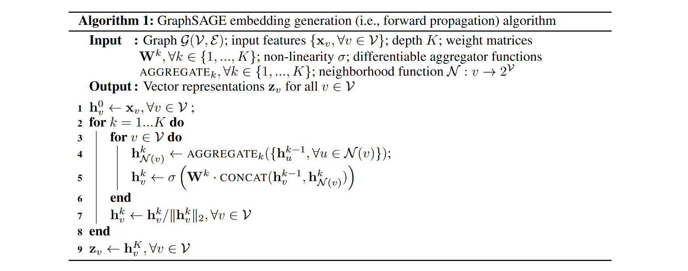
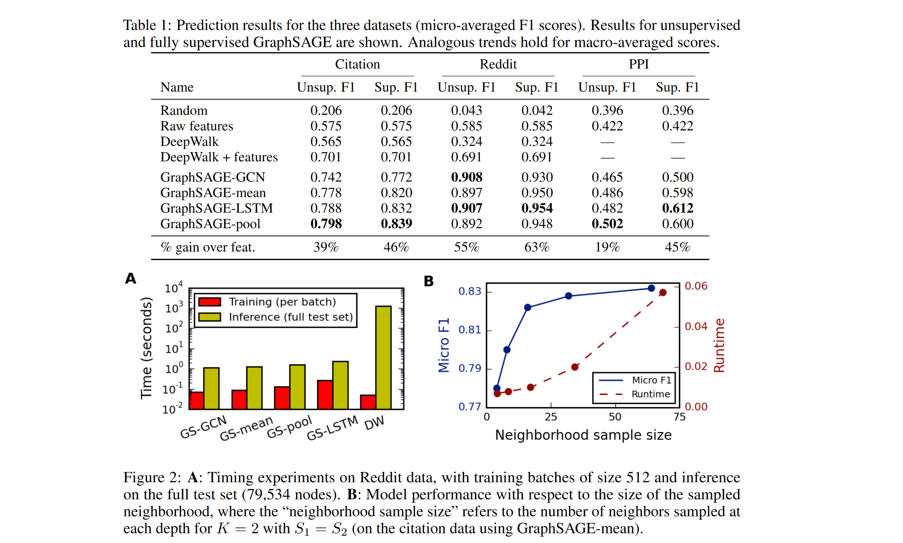
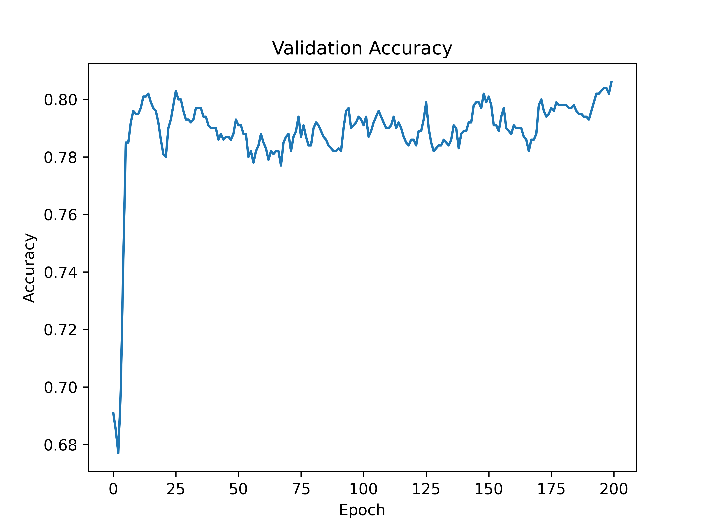
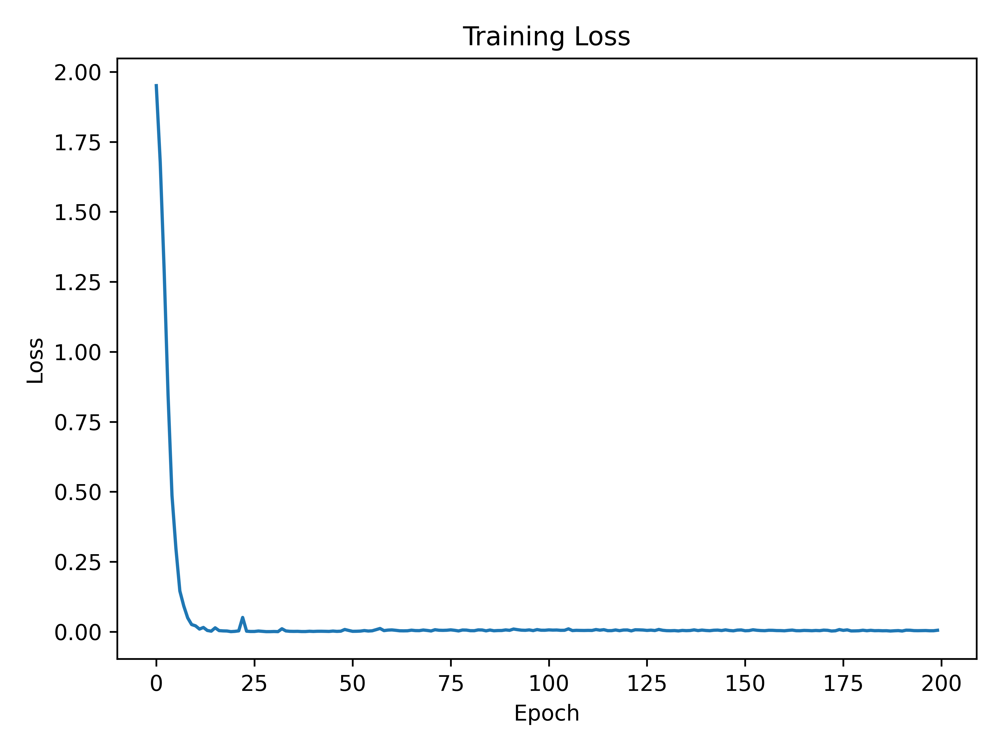

# Week5 GraphSAGE
## Paper Reading: [Inductive Representation Learning on Large Graphs](https://arxiv.org/pdf/1706.02216.pdf)
### Motivation
- 大部分大型图的节点嵌入方法训练时需要需要所有节点的信息，即transductive的，因此作者希望提出一种inductive的框架，对于无法得到的节点信息，同样也可以有效地进行节点嵌入

### Methodology
- 建模过程
  - embedding 
    - 首先，对于图中各个节点$v$ ，分别与它的直接邻居节点作聚合（k = 0的时候就是节点本身的特征向量）然后拼接到之前k-1层的节点表征向量$\mathbf{h}$  中；这样循环 $K$ 次以后得到最终输出 $\mathbf{z}_v$
    - minibatch：对于minibatch，我们就不对图中各个节点，而是只计算那些每个深度上满足递归所需的表示的节点
    - 邻居采样：不使用节点所有的邻居，而是每次迭代都均匀采样
  - aggregate
    - mean
        $$
        \mathbf{h}_{v}^{k} \leftarrow \sigma\left(\mathbf{W} \cdot \operatorname{MEAN}\left(\left\{\mathbf{h}_{v}^{k-1}\right\} \cup\left\{\mathbf{h}_{u}^{k-1}, \forall u \in \mathcal{N}(v)\right\}\right)\right)
        $$
    - max
        $$
        \operatorname{AGGREGATE}_{k}^{\mathrm{pool}}=\max \left(\left\{\sigma\left(\mathbf{W}_{\text {pool }} \mathbf{h}_{u_{i}}^{k}+\mathbf{b}\right), \forall u_{i} \in \mathcal{N}(v)\right\}\right)
        $$
    - lstm
- loss
    $$
    J_{\mathcal{G}}\left(\mathbf{z}_{u}\right)=-\log \left(\sigma\left(\mathbf{z}_{u}^{\top} \mathbf{z}_{v}\right)\right)-Q \cdot \mathbb{E}_{v_{n} \sim P_{n}(v)} \log \left(\sigma\left(-\mathbf{z}_{u}^{\top} \mathbf{z}_{v_{n}}\right)\right)
    $$
    $\mathbf{z}_{u}$ 是节点 $u$ 的嵌入向量
    GraphSAGE的loss分为两个部分：前一部分是用于学习正样本的相似性，从而增强正样本节点对节点$u$的相似性；后一部分是负采样损失，用于学习负样本的差异性。在这里，$Q$ 是负样本的数量，$\mathbb{E}_{v_{n} \sim P_{n}(v)}$ 表示从负样本分布 $P_{n}(v)$ 中随机采样 $Q$个负样本节点 $v_{n}$，而 $\mathbf{z}_{v_{n}}$ 是负样本节点 $v_{n}$的嵌入向量，从而增强负样本节点对节点  $u$ 的差异性

### Experiments
- 验证GraphSAGE 的分类任务表现性能：citation， reddit， PPI
    
- 比较不同的aggregate方式
    
    - LSTM, pool, mean 聚合比基于 GCN 的强；其中 LSTM和pool表现较好，pool运行速度比LSTM快


## Transductive & Inductive 
- Transductive: Transductive任务在训练和测试时都可以访问整个图，关注的是对 **已知图** 中的一部分节点进行预测或标签化。在Transductive任务中，模型对整个图的信息是已知的，因此可以根据整个图的上下文来进行预测。
- Inductive: Inductive任务在训练时只能访问一部分节点和它们的邻居，关注的是在模型从训练数据中学到的信息的基础上，对以前未见过的节点进行预测，在测试时要处理整个图，包括从未见过的节点。因此要求模型必须泛化到未见过的节点
- Difference between Transductive and Inductive: 所预测的样本在模型训练的时候已经使用或者访问过了，为transductive；否则为inductive

## GraphSAGE in `torch_geometric`
- code

```py
class GraphSAGE(nn.Module):
    def __init__(self, in_channels, hidden_channels, out_channels, dropout_rate = 0.5):
        super(GraphSAGE, self).__init__()
        self.conv1 = SAGEConv(in_channels, hidden_channels)
        self.conv2 = SAGEConv(hidden_channels, out_channels)
        self.dropout = nn.Dropout(dropout_rate)

    def forward(self, x, edge_index):
        x = self.conv1(x, edge_index)
        x = F.relu(x)
        x = self.dropout(x)
        x = self.conv2(x, edge_index)
        return F.log_softmax(x, dim=1)
```

- result: 79.76 ± 0.74

| rounds   | 1 | 2 | 3 | 4 | 5 | 6 | 7 | 8 | 9 | 10 |
|:--------:|:---:|:---:|:---:|:---:|:---:|:---:|:---:|:---:|:---:|:---:|
| accuracy |79.00|80.40|78.90|80.60|80.70|79.80|80.30|79.80|79.70|78.40|





## Conference
- [Inductive Representation Learning on Large Graphs](https://arxiv.org/pdf/1706.02216.pdf)
- [DGL](https://github.com/dmlc/dgl/tree/master/examples/pytorch)
- [pytorch geometric教程三 GraphSAGE源码详解+实战](https://blog.csdn.net/weixin_39925939/article/details/121343538)

